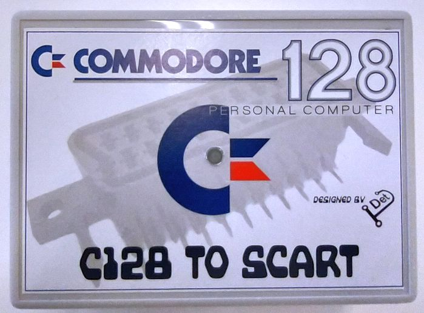
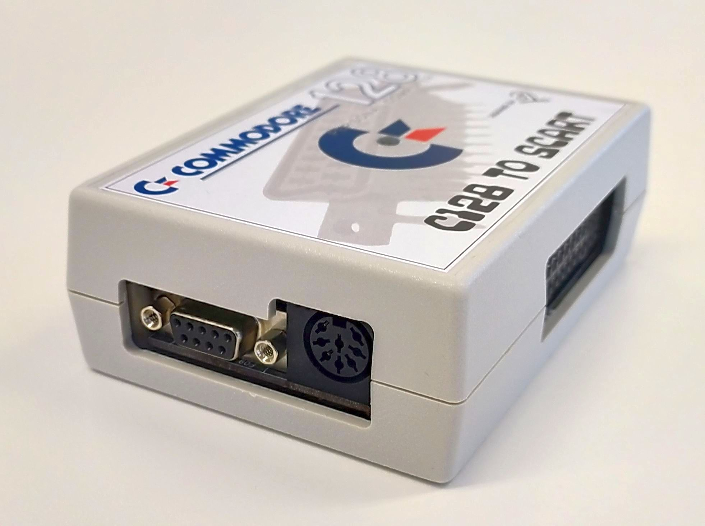
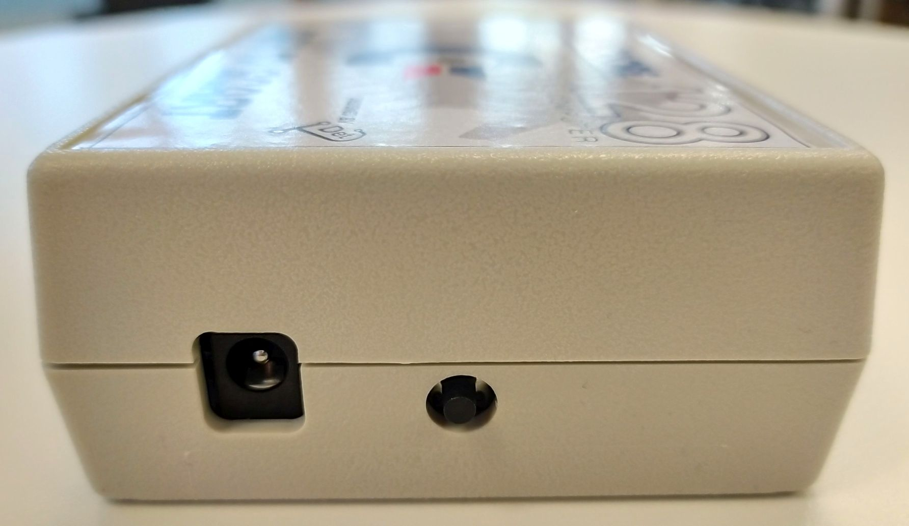
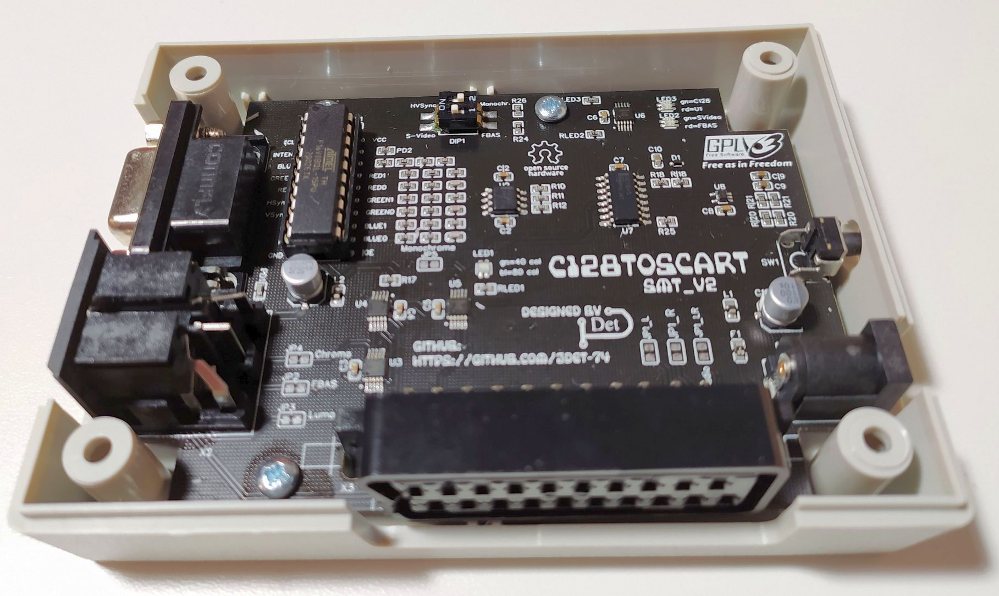

# C128toSCART_SMT
<h2>A further in SMT developed Version of the C128toSCART_THT project.</h2>

In a few weeks a further development of the "C128toSCART" project can be found here. 
It is a second version of the SMT variant with only a few THT components left.

You can watch a short intruduction video on YouTube -> <a href="https://youtu.be/qOvFwwrAEIk" target="_blank">C128toSCART_SMT</a>

The quality depends on the SCART display device. Make sure that the SCART input of your display device provides RGB, CVBS (composite) or S-Video (Luma & Chroma).

<h2>Boards and housings available</h2>

I currently have boards and housings in stock. Use the issue tracking system to get in touch with me.  
Take a look into the <strong>manual</strong> and the <strong>set_prices_shipping</strong> PDFs for more information.

After some of the boards I have ordered have been sold, I will make all project data available here.
 

The project can than be ordered with the <strong>GERBER, BOM and PNP</strong> files directly from JLCPCB.
JLCPCB offers an <strong>"SMT Assembly Service"</strong>.

All the files can then be found in the <strong>pcb_fabrication</strong> folder.

&nbsp;

Greetz  JDet

## Contact
For any questions (technical / experience), please use the issue tracking system of github. 

