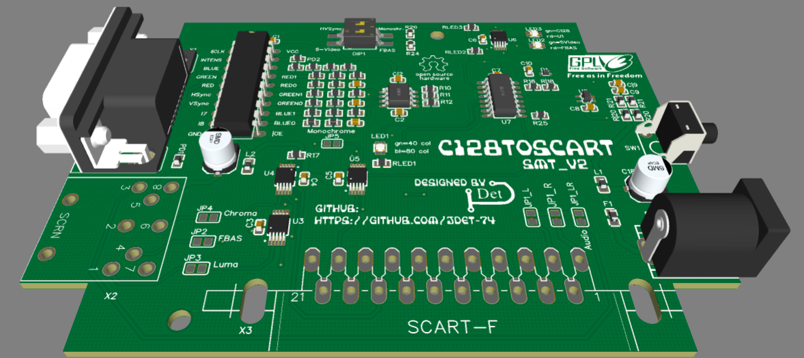
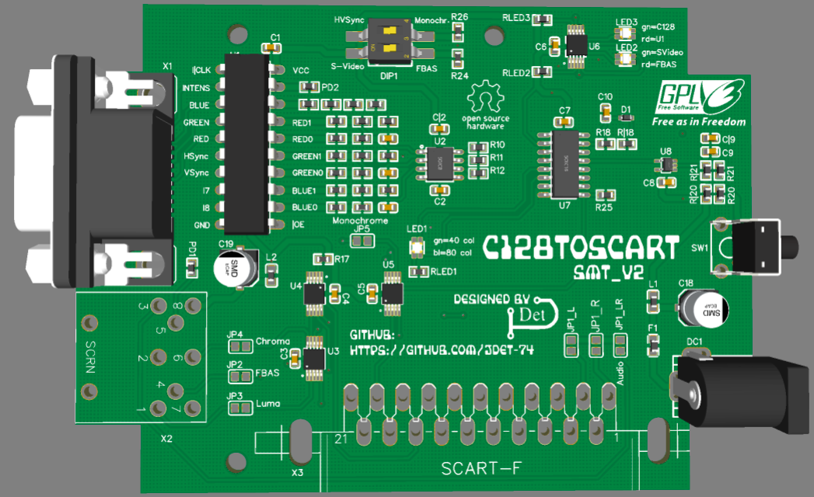
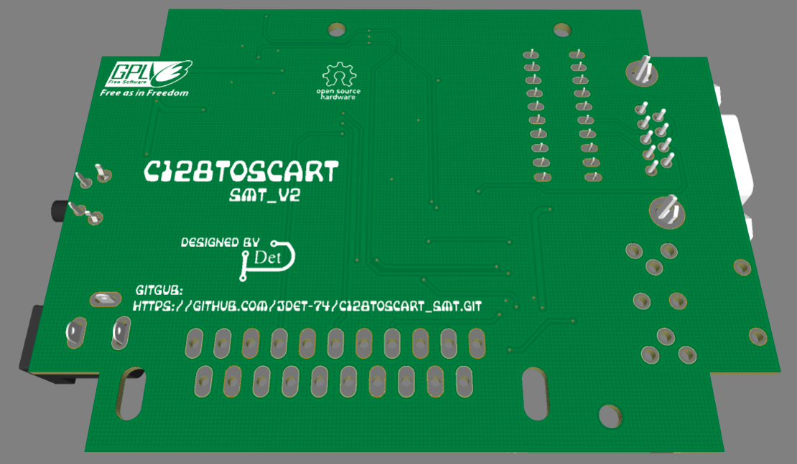

# C128toSCART_SMT
<h3>A further in SMT developed Version of the C128toSCART_THT project.</h3>

In a few weeks a further development of the "C128toSCART" project can be found here. 
It is a second version of the SMT variant with only a few THT components left.

The project can be ordered with the <strong>GERBER, BOM and PNP</strong> files directly from JLCPCB.
JLCPCB offers an <strong>"SMT Assembly Service"</strong> where up to 50 PCBs can be ordered.

I will soon put pictures of the current prototype online.

Greez  JDet

